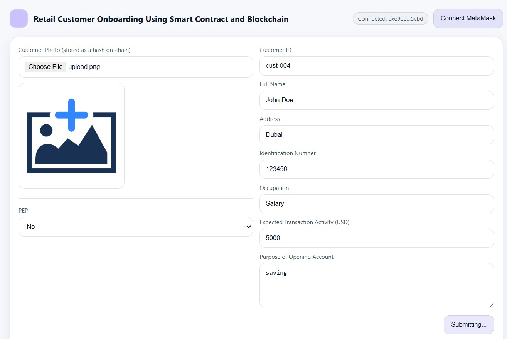
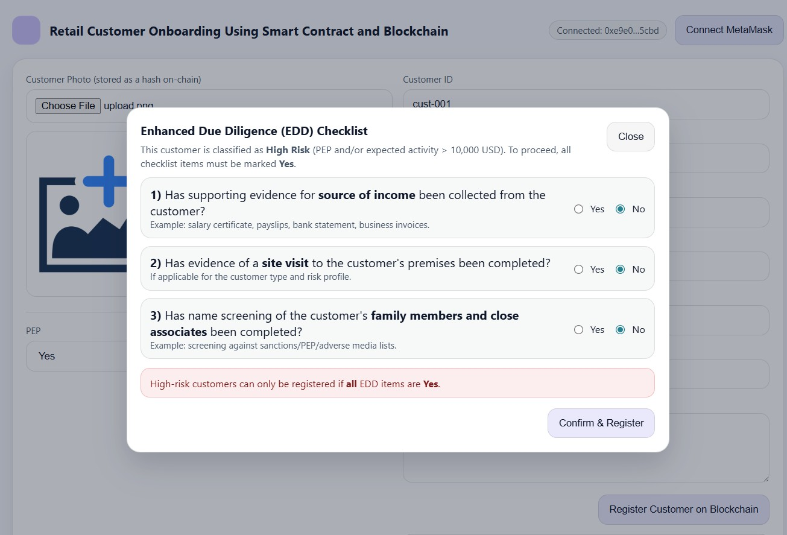

🔐 Blockchain-based AML KYC / CDD / EDD Prototype

This project is a blockchain-based proof of concept that demonstrates how smart contracts can support Customer Due Diligence (CDD) and Enhanced Due Diligence (EDD) in Anti-Money Laundering (AML) compliance.

The goal is to show how risk-based AML controls can be automated, consistent, and auditable using blockchain technology.

⚠️ Note: This is a demonstration prototype, not a production AML system.

🎯 Why This Project

    Traditional CDD and EDD processes are:

    Manual and time-consuming

    Repetitive across institutions

    Prone to errors and inconsistent application

    Difficult to audit

This prototype explores how blockchain can:

    Enforce AML rules automatically

    Reduce duplicate due-diligence effort

    Create tamper-proof audit trails

    Improve transparency and consistency

💡 What the Prototype Does

    Captures retail customer KYC details

    Identifies Politically Exposed Persons (PEPs)

    Applies risk-based logic using smart contracts

    Automatically triggers Enhanced Due Diligence (EDD)

    Blocks registration if EDD conditions are not met

    Prevents duplicate customer registration

    Records outcomes immutably on blockchain

🔍 Risk-Based EDD Logic (Example)

    A customer is classified as High Risk if:

    PEP = Yes

    Expected transaction activity > USD 10,000

    High-risk customers:

    Must complete all EDD checklist items

    Cannot register unless all conditions are satisfied

    Are governed by smart-contract rules, not manual overrides

🧩 Technology Stack

    Frontend: React, Next.js

    Blockchain: Solidity, Hardhat

    Wallet: MetaMask

    Network: Ethereum (Sepolia Testnet)

🖼️ Screenshots
###Customer KYC Registration

###EDD Trigger for High-Risk Customer

Blockchain Transaction Confirmation

🛡️ Permissioned Blockchain (Future Design)

While this prototype uses a public testnet, a production AML/KYC system should use a permissioned blockchain due to the sensitive nature of customer data.

Potential participants:

    Banks and exchange houses

    Licensed crypto exchanges

    AML and compliance teams

    Internal auditors

    Regulators (read-only access)

This enables privacy, controlled access, and regulatory oversight.

🚀 Future Enhancements

Off-chain document storage (IPFS + hashes on-chain)

Role-based approvals (maker / checker)

Periodic EDD reviews

Risk scoring engine

Sanctions & adverse media integration

Multi-institution KYC utility model

Anyone interested in RegTech, AML, or blockchain compliance solutions can explore or extend the project.

👤 About the Author

RiskSimplify Tech Solutions Pvt. Ltd
We apply AI, data science, and blockchain technologies to detect financial crime, enhance AML compliance, and support investigations through advanced analytics and traceability.

✨ Key Takeaway

This project demonstrates how blockchain and smart contracts can support risk-based AML compliance by making CDD and EDD automated, transparent, and auditable.